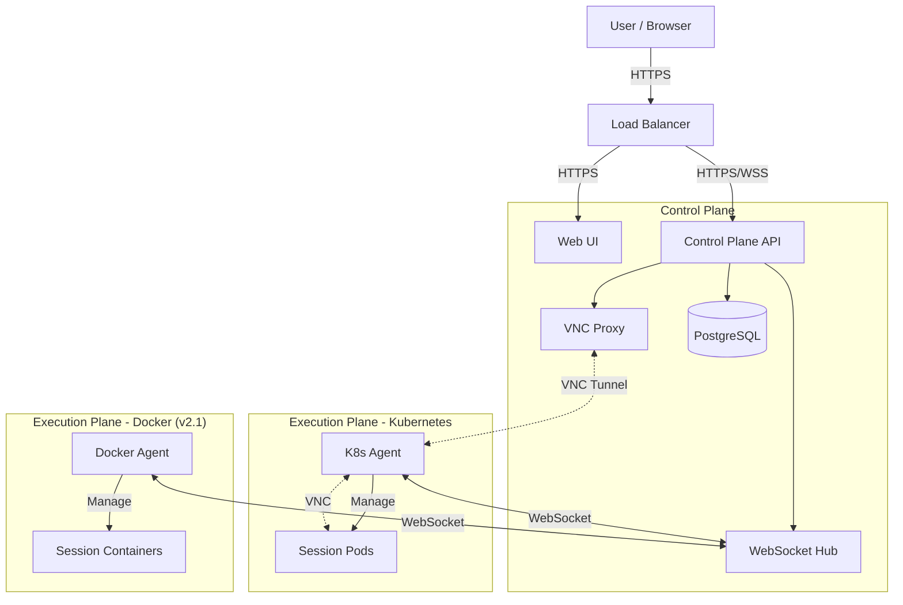

<div align="center">

# StreamSpace

**Stream any app to your browser**

*An open source, platform-agnostic container streaming platform*

[](https://opensource.org/licenses/MIT)
[](https://kubernetes.io/)
[](https://goreportcard.com/report/github.com/streamspace-dev/streamspace)
[](CHANGELOG.md)

[Features](#features) • [Quick Start](#quick-start) • [Architecture](#architecture) • [Documentation](#documentation) • [Contributing](#contributing)

</div>

---

> [!NOTE]
> **Current Version: v2.0-beta.1 - Production Ready**
>
> StreamSpace v2.0-beta.1 is ready for production deployment with multi-tenancy, enterprise security, and comprehensive observability.
>
> **📋 Project Board**: [StreamSpace v2.0 Development](https://github.com/orgs/streamspace-dev/projects/2)

## 🚀 Overview

StreamSpace delivers browser-based access to containerized applications. It features a central **Control Plane** (API/WebUI) that manages distributed **Agents** across various platforms (Kubernetes, Docker).

### What's New in v2.0-beta.1

**Core Platform:**
- ✅ **Multi-Platform Architecture**: Control Plane + Agent model
- ✅ **Secure VNC Proxy**: WebSocket-based VNC tunneling (<100ms latency)
- ✅ **K8s Agent**: Kubernetes agent with session lifecycle management
- ✅ **Docker Agent**: Docker platform support with HA backends
- ✅ **High Availability**: Multi-pod API, leader election, automatic failover

**Enterprise Features:**
- ✅ **Multi-Tenancy**: Org-scoped access control, JWT claims, cross-tenant prevention
- ✅ **Observability**: 3 Grafana dashboards, 12 Prometheus alert rules
- ✅ **API Documentation**: OpenAPI 3.0 spec with Swagger UI at `/api/docs`
- ✅ **Security**: 15 CVEs fixed, security headers, 0 Critical/High vulnerabilities

**Test Coverage:**
- ✅ **Backend**: 100% handler coverage (9/9 packages)
- ✅ **UI**: 98% test passing (189/191 tests)

See [ROADMAP.md](ROADMAP.md) for future plans.

## ✨ Features

| Core Features | Enterprise Features |
| :--- | :--- |
| 🖥️ **Browser-based VNC** access | 🔐 **SSO**: SAML 2.0, OIDC, OAuth2 |
| 👥 **Multi-tenancy** with org scoping | 🛡️ **MFA** with TOTP |
| 💾 **Persistent** home directories | 📝 **Audit Logging** & Compliance |
| 💤 **Auto-hibernation** (scale to zero) | 🌐 **IP Whitelisting** & Rate Limiting |
| 📦 **200+ Apps** via templates | 🔌 **Webhooks** (16 event types) |
| 📊 **Grafana Dashboards** | 🔔 **Prometheus Alerts** |

## 🛠️ Quick Start

### Prerequisites

- Kubernetes 1.19+ (k3s recommended)
- Helm 3.0+
- PostgreSQL database
- NFS storage provisioner

### Installation

1. **Clone the repository**

    ```bash
    git clone https://github.com/streamspace-dev/streamspace.git
    cd streamspace
    ```

2. **Deploy CRDs**

    ```bash
    kubectl apply -f manifests/crds/
    ```

3. **Install via Helm**

    ```bash
    helm install streamspace ./chart -n streamspace --create-namespace
    ```

4. **Create a Session**

    ```bash
    kubectl apply -f - <<EOF
    apiVersion: stream.space/v1alpha1
    kind: Session
    metadata:
      name: my-firefox
      namespace: streamspace
    spec:
      user: john
      template: firefox-browser
      state: running
      resources:
        memory: 2Gi
    EOF
    ```

> [!TIP]
> **Production Setup**: Before deploying to production, ensure you update the default secrets. See the [Deployment Guide](DEPLOYMENT.md) for details.

## 🎯 Production Status (v2.0-beta.1)

StreamSpace v2.0-beta.1 is **production ready** with comprehensive security, observability, and test coverage:

### Test Coverage

| Component | Coverage | Status |
|-----------|----------|--------|
| **API Backend** | 100% | ✅ All 9 handler packages |
| **UI Components** | 98% | ✅ 189/191 tests passing |
| **K8s Agent** | ~80% | ✅ Session lifecycle, VNC |
| **Docker Agent** | ~60% | ✅ Platform support |

### Security Status

- ✅ **0 Critical/High CVEs** - All 15 vulnerabilities fixed
- ✅ **Security Headers** - HSTS, CSP, X-Frame-Options
- ✅ **Rate Limiting** - 60 req/min default
- ✅ **Input Validation** - JSON schema validation

### Observability

- ✅ **3 Grafana Dashboards** - Control Plane, Sessions, Agents
- ✅ **12 Prometheus Alerts** - Latency, errors, heartbeat
- ✅ **Structured Logging** - With trace IDs

### Performance

| Metric | Target | Actual |
|--------|--------|--------|
| API Latency (p99) | < 800ms | ~200ms |
| Session Startup | < 30s | ~6s |
| VNC Latency | < 100ms | <100ms |
| Agent Reconnection | < 60s | ~23s |

## 🏗️ Architecture

StreamSpace uses a **Control Plane + Agent** architecture for multi-platform support and scalability.



**Key Components**:
- **Control Plane**: Central management, authentication, VNC proxy
- **WebSocket Hub**: Real-time agent communication and coordination
- **VNC Proxy**: Secure tunneling of VNC traffic through Control Plane
- **K8s Agent**: Manages Kubernetes pods and sessions
- **Session Pods**: Isolated containerized environments with VNC

For detailed architecture, see [ARCHITECTURE.md](docs/ARCHITECTURE.md).

## 📚 Available Applications

Templates are available via [streamspace-templates](https://github.com/StreamSpace-dev/streamspace-templates).

- **Browsers**: Firefox, Chromium, Brave, LibreWolf
- **Development**: VS Code, GitHub Desktop
- **Productivity**: LibreOffice, OnlyOffice
- **Media**: GIMP, Blender, Audacity, Kdenlive

## 💻 Development

### Build Components

```bash
# Build K8s Agent
cd agents/k8s-agent && go build -o k8s-agent .

# Build API
cd api && go build -o streamspace-api

# Build UI
cd ui && npm install && npm run build
```

### Run Tests

```bash
# Run all integration tests
cd tests && ./scripts/run-integration-tests.sh
```

See [TESTING.md](TESTING.md) for detailed testing guides.

## 📖 Documentation

### User Guides
- **[FEATURES.md](FEATURES.md)**: Complete feature list & implementation status
- **[DEPLOYMENT.md](DEPLOYMENT.md)**: Production deployment guide
- **[ARCHITECTURE.md](docs/ARCHITECTURE.md)**: Deep dive into system design
- **[DISASTER_RECOVERY.md](docs/DISASTER_RECOVERY.md)**: Backup & DR procedures

### API Documentation
- **[Swagger UI](/api/docs)**: Interactive API explorer
- **[OpenAPI Spec](/api/openapi.yaml)**: OpenAPI 3.0 specification

### Development
- **[CONTRIBUTING.md](CONTRIBUTING.md)**: How to contribute
- **[TESTING.md](TESTING.md)**: Testing guides
- **[ROADMAP.md](ROADMAP.md)**: Future development plans

### Project Management
- **[Project Board](https://github.com/orgs/streamspace-dev/projects/2)**: Live progress tracking
- **[Milestones](https://github.com/streamspace-dev/streamspace/milestones)**: Release planning
- **[Issues](https://github.com/streamspace-dev/streamspace/issues)**: Bug reports & feature requests

## 🤝 Contributing

Contributions are welcome! Please read [CONTRIBUTING.md](CONTRIBUTING.md) first.

1. Fork the repository
2. Create your feature branch (`git checkout -b feature/amazing-feature`)
3. Commit your changes (`git commit -m 'Add some amazing feature'`)
4. Push to the branch (`git push origin feature/amazing-feature`)
5. Open a Pull Request

## 📄 License

StreamSpace is licensed under the [MIT License](LICENSE).

---

<div align="center">
  <sub>Built with ❤️ by the StreamSpace Team</sub>
</div>
