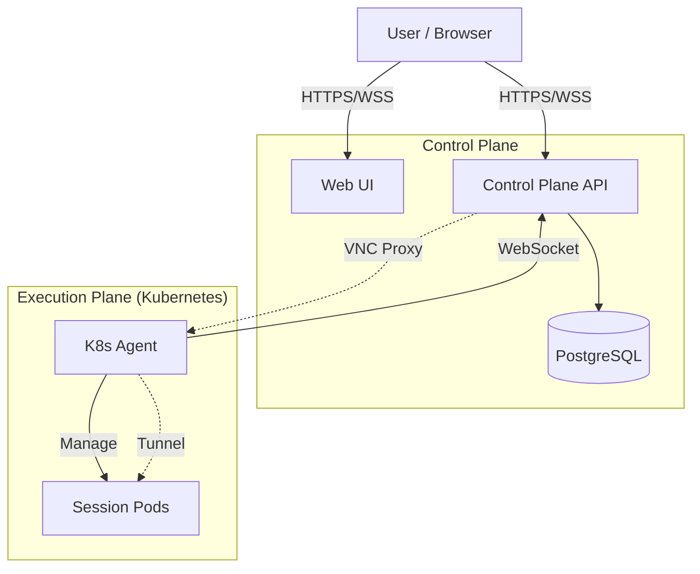

<div align="center">

# StreamSpace

**Stream any app to your browser**

*An open source, platform-agnostic container streaming platform*

[](https://opensource.org/licenses/MIT)
[](https://kubernetes.io/)
[](https://goreportcard.com/report/github.com/streamspace-dev/streamspace)
[](CHANGELOG.md)

[Features](#features) • [Quick Start](#quick-start) • [Architecture](#architecture) • [Documentation](#documentation) • [Contributing](#contributing)

</div>

---

> [!IMPORTANT]
> **Current Version: v2.0-beta**
>
> StreamSpace has completed a major architectural transformation to a multi-platform Control Plane + Agent model. v2.0-beta development is complete with integration testing underway.

## 🚀 Overview

StreamSpace delivers browser-based access to containerized applications. It features a central **Control Plane** (API/WebUI) that manages distributed **Controllers** across various platforms (Kubernetes, Docker, Hyper-V, vCenter, etc.).

### What's New in v2.0-beta

- **Multi-Platform Architecture**: Control Plane + Agent model.
- **End-to-End VNC Proxy**: Secure, firewall-friendly traffic flow.
- **K8s Agent**: Fully functional Kubernetes agent with VNC tunneling.
- **Modern UI**: Real-time agent monitoring and modernized VNC viewer.

## ✨ Features

| Core Features | Enterprise Features |
| :--- | :--- |
| 🖥️ **Browser-based VNC** access | 🔐 **SSO**: SAML 2.0, OIDC, OAuth2 |
| 👥 **Multi-user** isolation | 🛡️ **MFA** with TOTP |
| 💾 **Persistent** home directories | 📝 **Audit Logging** & Compliance |
| 💤 **Auto-hibernation** (scale to zero) | 🌐 **IP Whitelisting** & Rate Limiting |
| 📦 **200+ Apps** via templates | 🔌 **Webhooks** (Slack, Teams, Discord) |

## 🛠️ Quick Start

### Prerequisites

- Kubernetes 1.19+ (k3s recommended)
- Helm 3.0+
- PostgreSQL database
- NFS storage provisioner

### Installation

1. **Clone the repository**

    ```bash
    git clone https://github.com/streamspace-dev/streamspace.git
    cd streamspace
    ```

2. **Deploy CRDs**

    ```bash
    kubectl apply -f manifests/crds/
    ```

3. **Install via Helm**

    ```bash
    helm install streamspace ./chart -n streamspace --create-namespace
    ```

4. **Create a Session**

    ```bash
    kubectl apply -f - <<EOF
    apiVersion: stream.space/v1alpha1
    kind: Session
    metadata:
      name: my-firefox
      namespace: streamspace
    spec:
      user: john
      template: firefox-browser
      state: running
      resources:
        memory: 2Gi
    EOF
    ```

> [!TIP]
> **Production Setup**: Before deploying to production, ensure you update the default secrets. See the [Deployment Guide](DEPLOYMENT.md) for details.

## 🏗️ Architecture

StreamSpace uses a split architecture separating the Control Plane from the Execution Agents.



## 📚 Available Applications

Templates are available via [streamspace-templates](https://github.com/StreamSpace-dev/streamspace-templates).

- **Browsers**: Firefox, Chromium, Brave, LibreWolf
- **Development**: VS Code, GitHub Desktop
- **Productivity**: LibreOffice, OnlyOffice
- **Media**: GIMP, Blender, Audacity, Kdenlive

## 💻 Development

### Build Components

```bash
# Build K8s Agent
cd agents/k8s-agent && go build -o k8s-agent .

# Build API
cd api && go build -o streamspace-api

# Build UI
cd ui && npm install && npm run build
```

### Run Tests

```bash
# Run all integration tests
cd tests && ./scripts/run-integration-tests.sh
```

See [TESTING.md](TESTING.md) for detailed testing guides.

## 📖 Documentation

- **[FEATURES.md](FEATURES.md)**: Feature list & status
- **[ROADMAP.md](ROADMAP.md)**: Future plans
- **[ARCHITECTURE.md](docs/ARCHITECTURE.md)**: Deep dive into system design
- **[DEPLOYMENT.md](DEPLOYMENT.md)**: Production deployment guide
- **[CONTRIBUTING.md](CONTRIBUTING.md)**: How to contribute

## 🤝 Contributing

Contributions are welcome! Please read [CONTRIBUTING.md](CONTRIBUTING.md) first.

1. Fork the repository
2. Create your feature branch (`git checkout -b feature/amazing-feature`)
3. Commit your changes (`git commit -m 'Add some amazing feature'`)
4. Push to the branch (`git push origin feature/amazing-feature`)
5. Open a Pull Request

## 📄 License

StreamSpace is licensed under the [MIT License](LICENSE).

---

<div align="center">
  <sub>Built with ❤️ by the StreamSpace Team</sub>
</div>
