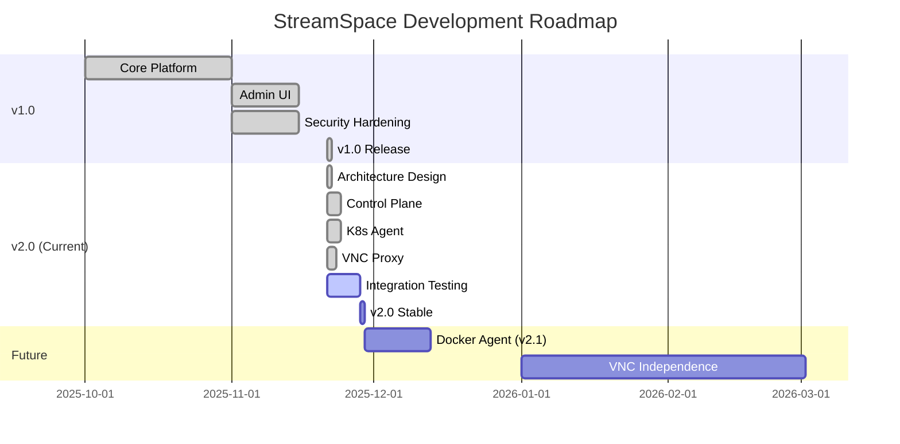

# 🗺️ StreamSpace Roadmap

**Current Version**: v2.0-beta • **Last Updated**: 2025-11-21

---

> [!IMPORTANT]
> **Current Status: v2.0-beta (Integration Testing)**
>
> StreamSpace has completed the major architectural transformation to a multi-platform Control Plane + Agent model. We are currently in the integration testing phase.

## 📅 Release Timeline

## 🎯 Priorities

### 1. Integration Testing (Immediate)

- **Focus**: Validate the new v2.0 Control Plane + Agent architecture.
- **Tasks**:
  - [ ] E2E VNC streaming validation
  - [ ] Multi-agent session creation
  - [ ] Failover and reconnection tests
  - [ ] Performance benchmarking

### 2. Test Coverage Expansion (High)

- **Current**: ~70% on new v2.0 code, ~20% overall.
- **Target**: 80%+ overall.
- **Plan**:
  - [ ] Expand API handler tests
  - [ ] Add UI component tests
  - [ ] Increase controller test coverage

### 3. Plugin Implementation (Medium)

- **Current**: Framework complete, 28 stub plugins.
- **Target**: Working implementations for top 10 plugins.
- **Top Plugins**:
  - Calendar, Slack, Teams, Discord, PagerDuty
  - Compliance, DLP, Analytics

### 4. Docker Support (v2.1)

- **Current**: Planned.
- **Target**: Functional Docker Agent.
- **Scope**:
  - Container lifecycle management
  - Local volume management
  - Network configuration

## 🛤️ Detailed Roadmap

### v1.0.0-READY (Completed) ✅

- **Core**: Functional Kubernetes platform
- **Auth**: Complete authentication stack (SAML, OIDC, MFA)
- **Admin**: Full admin UI and configuration
- **Security**: Production-hardened (Audit logs, RBAC, Security headers)

### v2.0-beta (Current) 🚧

- **Architecture**: Multi-platform Control Plane + Agent
- **Connectivity**: Secure VNC Proxy (Firewall-friendly)
- **Agent**: Kubernetes Agent implementation
- **UI**: Real-time agent monitoring

### v2.1 (Planned) 📝

- **Platform**: Docker Agent support
- **Deployment**: Docker Compose support
- **Storage**: Local volume management

### v3.0 (Future) 🔮

- **Streaming**: WebRTC support for lower latency
- **VNC**: Migration to TigerVNC + noVNC (native images)
- **Hardware**: GPU acceleration support
- **Federation**: Multi-cluster support

## 🤝 How to Contribute

We welcome contributions! Here are the high-impact areas:

1. **Testing**: Help us reach our 80% coverage goal.
2. **Plugins**: Pick a stub plugin and implement it.
3. **Documentation**: Improve guides and examples.

See [CONTRIBUTING.md](CONTRIBUTING.md) for details.

---

  StreamSpace Roadmap

