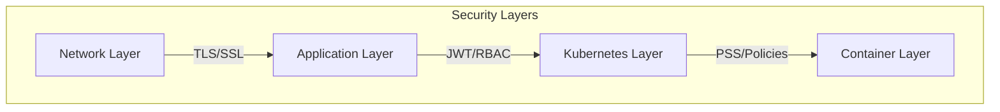

<div align="center">

# 🛡️ StreamSpace Security Policy

**Status**: ✅ **PRODUCTION-READY** • **Last Review**: 2025-11-14

[](SECURITY.md)

</div>

---

> [!IMPORTANT]
> **Security Status: Production Ready**
>
> StreamSpace has completed comprehensive security hardening (Phases 1-5). All critical and high severity issues have been resolved. The platform implements enterprise-grade defense-in-depth controls.

## 🔒 Reporting Vulnerabilities

**Do not open public issues for security vulnerabilities.**

### Preferred Method

1. Go to [Security Advisories](https://github.com/streamspace-dev/streamspace/security/advisories).
2. Click "Report a vulnerability".
3. We will respond within **48 hours**.

### Alternative

Email: **<security@streamspace.io>**

---

## ✅ Security Controls

### Critical Issues Resolved (10/10)

| Issue | Status | Fix |
| :--- | :--- | :--- |
| **Secrets in ConfigMaps** | ✅ Fixed | Secrets moved to K8s Secrets |
| **Unauthenticated API** | ✅ Fixed | Auth middleware on all routes |
| **Open CORS** | ✅ Fixed | Whitelist enforcement |
| **Weak JWT Secret** | ✅ Fixed | Minimum 32-char enforcement |
| **SQL Injection** | ✅ Fixed | Parameterized queries |
| **No Rate Limiting** | ✅ Fixed | Token bucket (100 req/s) |
| **Elevated Privileges** | ✅ Fixed | Pod Security Standards |
| **Input Validation** | ✅ Fixed | Strict schema validation |
| **Webhook Auth** | ✅ Fixed | HMAC-SHA256 signatures |
| **RBAC Permissions** | ✅ Fixed | Least-privilege roles |

### Defense in Depth



## 🔧 Security Configuration

### Required Environment Variables

> [!CAUTION]
> The application will fail to start if these are missing.

- **`JWT_SECRET`**: Min 32 characters. Signs auth tokens.

  ```bash
  export JWT_SECRET=$(openssl rand -base64 32)
  ```

### Recommended Configuration

- **`CORS_ALLOWED_ORIGINS`**: Comma-separated list of allowed domains.
- **`WEBHOOK_SECRET`**: For validating webhook signatures.
- **`DB_SSL_MODE`**: Set to `require` or `verify-full` in production.

## 🧪 Security Testing Checklist

### Pre-Deployment

- [ ] **Secrets**: Generated securely, no defaults.
- [ ] **TLS**: Enabled on all ingress.
- [ ] **Network Policies**: Enabled and tested.
- [ ] **Authentication**: Enabled on all routes.
- [ ] **RBAC**: Least-privilege verified.
- [ ] **Scanning**: Container images scanned for vulnerabilities.

### Automated Scanning

We use the following tools in our CI/CD pipeline:

- **Container Scanning**: Trivy
- **Manifest Scanning**: Kubesec, Checkov
- **Dependency Scanning**: Nancy (Go), npm audit
- **Secret Detection**: Gitleaks

---

<div align="center">
  <sub>StreamSpace Security</sub>
</div>
