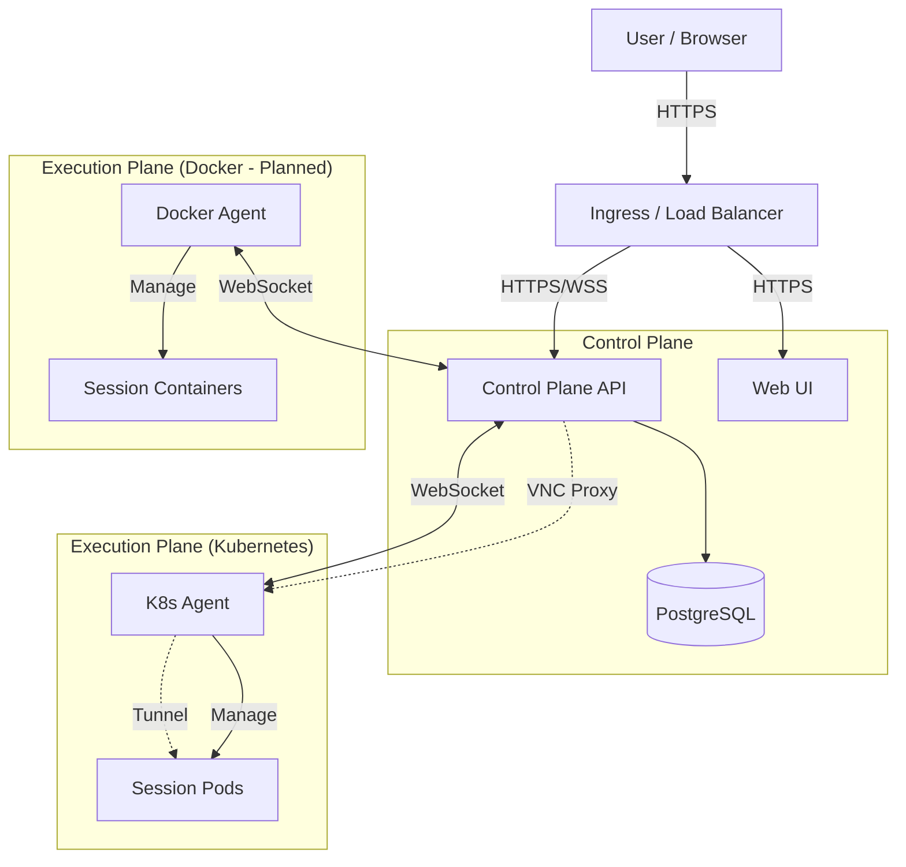
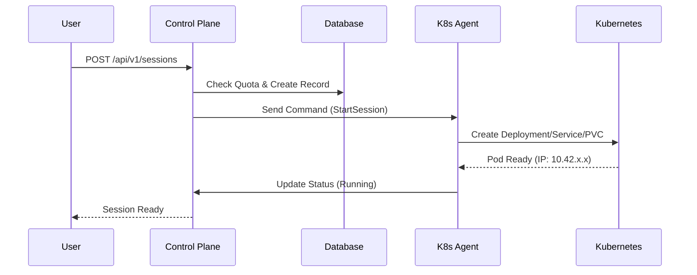
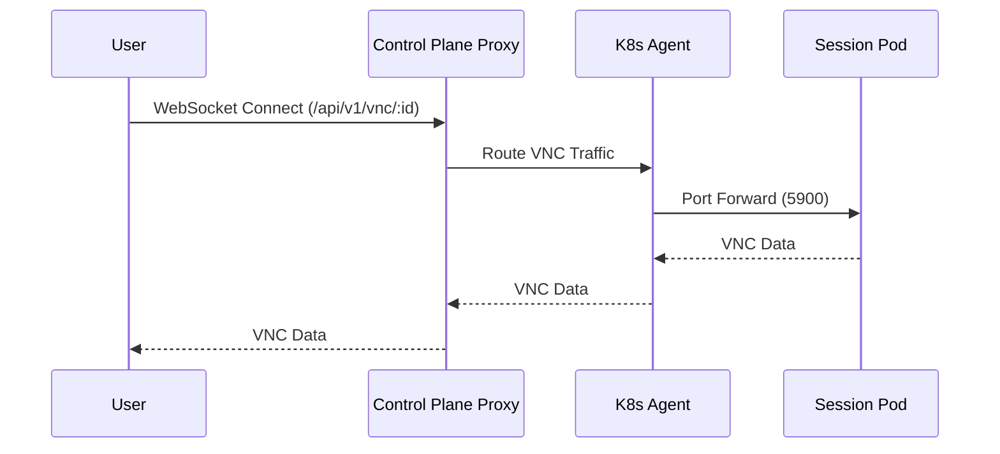

# 🏗️ StreamSpace Architecture

**Version**: v2.0-beta • **Last Updated**: 2025-11-21

---

> [!IMPORTANT]
> **v2.0 Architecture Update**
>
> StreamSpace has evolved to a **Control Plane + Agent** architecture. The Control Plane acts as the central management hub, while Agents (Kubernetes, Docker, etc.) execute commands and manage resources on their respective platforms.

## 🧩 System Overview

StreamSpace is a platform-agnostic container streaming platform. It separates the management logic (Control Plane) from the execution logic (Agents), allowing for scalability and multi-platform support.

### High-Level Architecture

## 📦 Core Components

### 1. Control Plane (API)

- **Role**: Central brain of the system.
- **Tech**: Go (Gin framework).
- **Responsibilities**:
  - User Authentication & Authorization (SAML, OIDC).
  - Session Management (CRUD).
  - Agent Coordination (WebSocket Hub).
  - VNC Proxying (Secure tunneling).
  - Database Management.

### 2. Execution Agents

- **Role**: Platform-specific executors.
- **Tech**: Go.
- **Types**:
  - **Kubernetes Agent**: Manages Pods, PVCs, Services.
  - **Docker Agent** (v2.1): Manages Containers, Volumes.
- **Responsibilities**:
  - Connect to Control Plane via secure WebSocket.
  - Execute commands (Start, Stop, Hibernate).
  - Report status and metrics (Heartbeats).
  - Tunnel VNC traffic.

### 3. Web UI

- **Role**: User interface.
- **Tech**: React + TypeScript + Material-UI.
- **Features**:
  - Dashboard & Catalog.
  - Session Viewer (noVNC integration).
  - Admin Panel (User, Agent, Plugin management).

### 4. Session Workspaces

- **Role**: The actual user environment.
- **Tech**: Containerized applications (LinuxServer.io images).
- **Features**:
  - KasmVNC for streaming.
  - Persistent home directory.
  - Isolated environment.

## 🔄 Data Flow

### Session Creation

### VNC Streaming (v2.0 Proxy)

## 🛡️ Security Architecture

### Authentication

- **SSO**: Authentik, Okta, Azure AD via OIDC/SAML.
- **Tokens**: JWT (Access + Refresh).
- **MFA**: TOTP support.

### Network Security

- **Ingress**: TLS/SSL enforced.
- **Isolation**: Network Policies deny inter-pod traffic by default.
- **Proxy**: All VNC traffic flows through Control Plane (no direct pod access).

### Data Protection

- **Storage**: Per-user PVCs with RBAC.
- **Encryption**: Secrets management for sensitive data.
- **Audit**: Comprehensive logging of all actions.

## 💾 Resource Management

### Quotas

- **Per User**: Max sessions, CPU, Memory.
- **Enforcement**: Checked at API level before command dispatch.

### Hibernation

- **Auto-Scale**: Idle sessions scale to 0 replicas.
- **Wake**: Instant resume on user interaction.
- **Persistence**: PVCs remain mounted/available.

## 🔌 Plugin System

The plugin system allows extending functionality without modifying the core.

- **Types**: Extension, Webhook, Integration, Theme.
- **Storage**: JSONB configuration in database.
- **Events**: Plugins can subscribe to system events (SessionStart, UserLogin, etc.).

---

  StreamSpace Architecture Documentation

